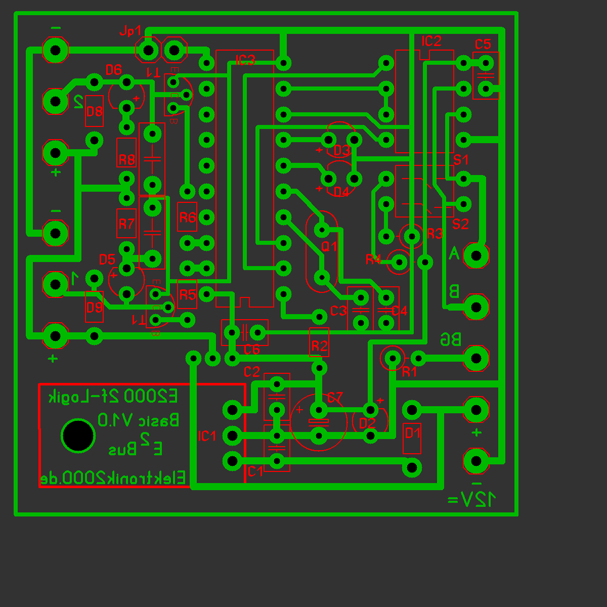

# XLay

This library is based on the reverse engeneering of Sergey-Raevskiy (https://github.com/sergey-raevskiy/xlay). It can render a layout (with some restrictions).

The Software SprintLayout 6 is published and sold by [Abacom](https://www.electronic-software-shop.com/elektronik-software/sprint-layout-60.html?language=de
). I do not have anything to do with this company. 

The core feature of this library is to analyze a `*.lay6` file and draw its content in an image. By now only drawing of a pixel image is supported. 

## Short Example

### Render board 0 from a lay6-fiel
``` php
<?php

require_once("../src/xlay.inc.php");

$file = \XLay\XLay::loadLay6("test.lay6");
$renderer = new \XLay\Renderer\Image();
$renderer->render($file->getBoards()[0], $filename, \XLay\Layer::LAYERS_DEFAULT_ORDER);

```



### Render a macro

``` php
<?php

require_once("../src/xlay.inc.php");

$file = \XLay\XLay::loadMacro("test.lay6");
$renderer = new \XLay\Renderer\Image();
$renderer->render($file, $filename, \XLay\Layer::LAYERS_DEFAULT_ORDER,[0,0,0],[$file->getOffsetX(),$file->getOffsetY()]);

```

## ToDo

[HERE](TODO.md)